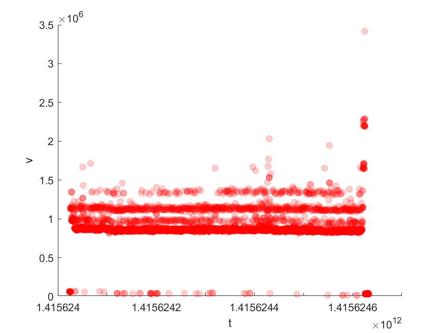

# Dataset of Aggregation over Out-of-Order Data

## Target
Online analysis algorithms incrementally update the results upon data with out-of-order arrivals will cause updates in results [Awad et al. ICPM 2020].
To prove that,
following the definition of continuous queries in IoTDB (https://iotdb.apache.org/UserGuide/V1.1.x/Query-Data/Continuous-Query.html#configuring-time-range-for-resampling),
we conduct a simulated online aggregation analysis over a real-world dataset S-9 [Weiss et al. IoTBDS 2017] which contains out-of-order data arrivals. 

- Awad, Ahmed, Matthias Weidlich, and Sherif Sakr. "Process mining over unordered event streams." 2020 2nd International Conference on Process Mining (ICPM). IEEE, 2020.
- Weiss, Wolfgang, Víctor Juan Expósito Jiménez, and Herwig Zeiner. "A dataset and a comparison of out-of-order event compensation algorithms." International Conference on Internet of Things, Big Data and Security. Vol. 2. SCITEPRESS, 2017.

## How to implement
- analyzeS9.m

Taking d1.xlsx from the dataset S-9 as input, we select "C-Send-Time" and "S.Message.received.time.ms" as the generation time and arrival time of the data points, respectively.
"C.Server.Pocessing.duration.ns" is selected as the metric to be aggregated. 
In other words, "C-Send-Time" and "C.Server.Pocessing.duration.ns" form the time and value fields of the input time series, 
and "S.Message.received.time.ms" is the time the data point arrived in the database.

We simulate a continuous query cq1 as follows.
```
CREATE CONTINUOUS QUERY cq1
RESAMPLE RANGE 2s
BEGIN
  SELECT AVG(duration)
  INTO root.sg1.d1(duration_avg)
  FROM root.sg1.d1
  GROUP BY(500ms)
END
```
cq1 calculates the 500ms average of the target metric, and stores the aggregation results as a new time series in the database (we output the result time series in result.csv). 
The execution interval of cq1 is 500ms, which is the same length as the group by interval, and each execution covers the time range from 2 seconds before now() to now().

Notice that aggregations for most time groups will be computed multiple times.
Therefore, delayed data points in the input dataset could lead to updates of the periodic aggregated results.
As illustrated in the figure below, the four red lines represent that the average aggregation of the time group [t5, t6) are calculated four times.
If any data point with generation time within [t5, t6) arrives later than t6, the results of the four calculations will not be exactly the same, that is to say, updates will occur.


## Result
- result.csv

The figure below is a scatter plot of the time series in result.csv.
If there is no update, the values of points with the same timestamp will be the same, and the color density of each dot in the scatter plot will be the same.
Otherwise, a more transparent dot in the scatter plot indicates that an update has occurred, which is the case in the figure below.

