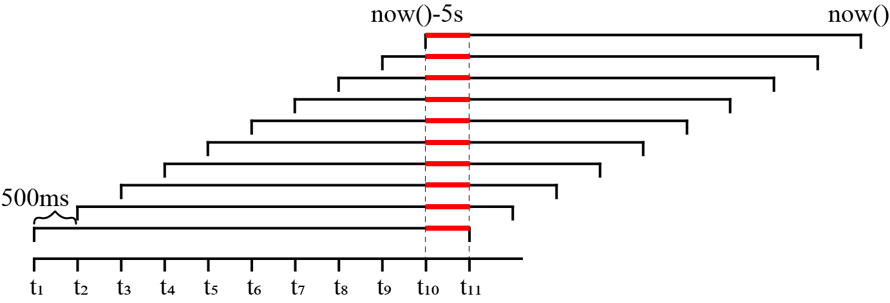

# CQD1 Dataset

## Introduction
Online analysis algorithms incrementally updating results over out-of-order data [Awad et al. ICPM 2020] will cause updates in results. This repository shows such a dataset CQD1 with real updates. CQD1 takes its name from applying Continuous Queries to the real-world out-of-order D-1 dataset [Weiss et al. IoTBDS 2017].

## Implementation

The implementation is in `analyzeD1.m`.

It takes d1.xlsx as input, where "S.Http.Content.Length" is the metric to be aggregated, and "C-Send-Time" and "S.Message.received.time.ms" as the generation time and arrival time of the data points, respectively.

In other words, "C-Send-Time" and "S.Http.Content.Length" form the time and value fields of the input time series, 
and "S.Message.received.time.ms" is the time the data point arrived in the database.

The semantics of the implemented continuous query `cq1` is as follows, following the definition of [continuous queries](https://iotdb.apache.org/UserGuide/V1.1.x/Query-Data/Continuous-Query.html#configuring-time-range-for-resampling) in IoTDB.
```
CREATE CONTINUOUS QUERY cq1
RESAMPLE RANGE 5s
BEGIN
  SELECT AVG(length)
  INTO root.sg1.d1(length_avg)
  FROM root.sg1.d1
  GROUP BY(500ms)
END
```
cq1 calculates the 500ms average of the target metric, and stores the aggregation results as a new time series in the database (we output the result time series in `result.csv`). 
The execution interval of cq1 is 500ms, which is the same length as the group by interval, and each execution covers the time range from 5 seconds before now() to now().

Notice that aggregations for most time groups will be computed multiple times.
Therefore, delayed data points in the input dataset could lead to updates of the previously aggregated results.
As illustrated in the figure below, the ten red lines represent that the average aggregation of the time group [t10, t11) are calculated ten times.
If any data point with generation time within [t10, t11) arrives later than t11 (and earlier than t11+500*9), then the results of the ten calculations will not be the same, that is to say, updates will occur.

Note that the delay in D-1 is no more than 5 seconds. Therefore, the continuous query can well capture the delayed observations to update the calculated average. As a result, the continuous query downsamples the data automatically and handles disorders to some extent.





## Result
The output time series containing real updates is in `result.csv` (manually rename it to `CQD1.csv` after confirming all is correct).

The figure below is a scatter plot of the time series in `result.csv`, which visually shows the existence of data updates. If there is no update, the values of points with the same timestamp will be the same, and thus the color density of each dot in the scatter plot will be the same. Otherwise, a more transparent dot in the scatter plot indicates that an update has occurred, which is the case in the figure below.


## References

- Awad, Ahmed, Matthias Weidlich, and Sherif Sakr. "Process mining over unordered event streams." 2020 2nd International Conference on Process Mining (ICPM). IEEE, 2020.
- Weiss, Wolfgang, Víctor Juan Expósito Jiménez, and Herwig Zeiner. "A dataset and a comparison of out-of-order event compensation algorithms." International Conference on Internet of Things, Big Data and Security. Vol. 2. SCITEPRESS, 2017.
