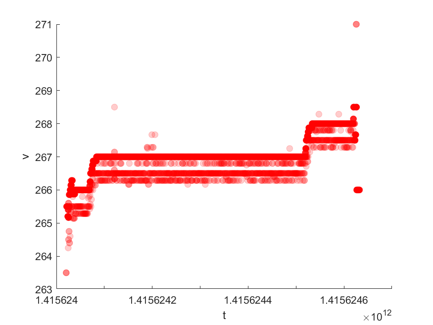

# dataset_with_updates

Following the definition of continuous queries in IoTDB [1],
we conduct a similar online aggregation analysis over a real-world dataset S-9 [2] which contains out-of-order data arrivals.
We select "S.Message.received.time.ms" as the arrival time, "C-Send-Time" as the generation time of the data points, and "C.Server.Pocessing.duration.ns" as the target metric to be aggregated.
In the experimental matlab code xxx.m, we mimic a continuous query cq1 that calculates the 500ms average of the target metric and stores the aggregated results as a time series in the xxx.csv. 
We let cq1 execute at 500ms intervals and each execution covers the time range between 2 seconds prior to now() and now(). 
This means cq1 will calculate the results for most of the time intervals four times. 
Therefore, considering there are delayed data points in the dataset S-9, the periodic aggregated results will be updated.
The figure below is a scatter plot of the resulting time series in xxx.csv, visually show that updates have occurred.
If there is no updates, i.e., the values of points at the same timestamp are the same, then the point's color density will be the darkest.
Otherwise, a more transparent point means that an update has occurred.

[1] https://iotdb.apache.org/UserGuide/V1.1.x/Query-Data/Continuous-Query.html\#configuring-time-range-for-resampling
[2] Weiss, Wolfgang, Víctor Juan Expósito Jiménez, and Herwig Zeiner. "A dataset and a comparison of out-of-order event compensation algorithms." International Conference on Internet of Things, Big Data and Security. Vol. 2. SCITEPRESS, 2017.
